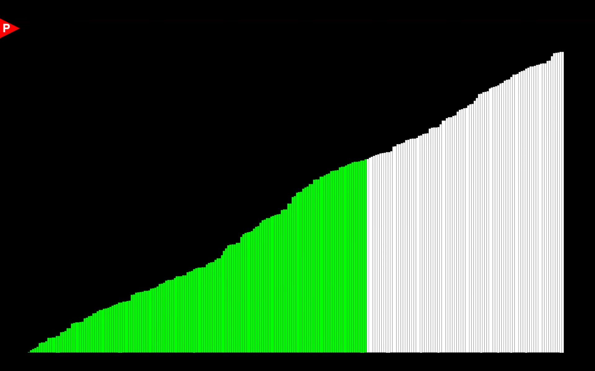

# Sort Methods
 Visualizing various sorting methods.

### Features:
> randomized integer array represented by rectangles with height of integer to visualize sorting process

> abstract base class "sort methods" that allows any customized sorting method to be used in conjunction with the rendering part of the program

> step-by-step animation of sorting method working in real time

> "finish" animation once array is fully sorted, where entire array turns green

### more pictures:

